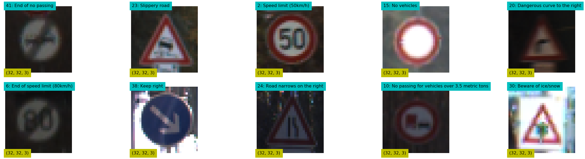
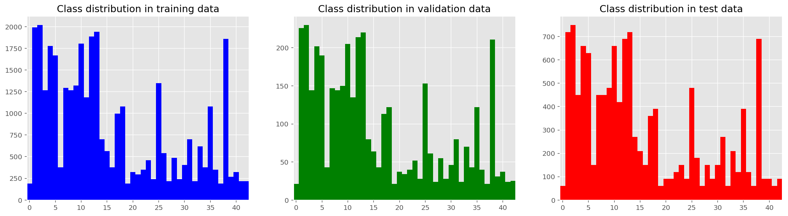
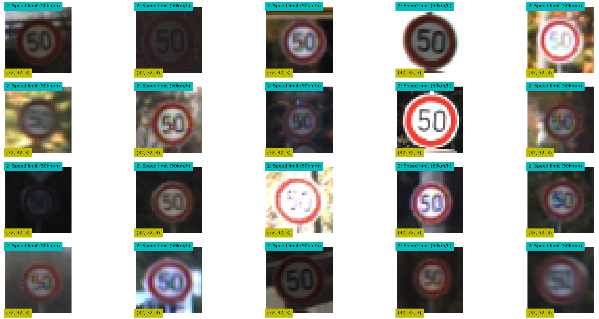
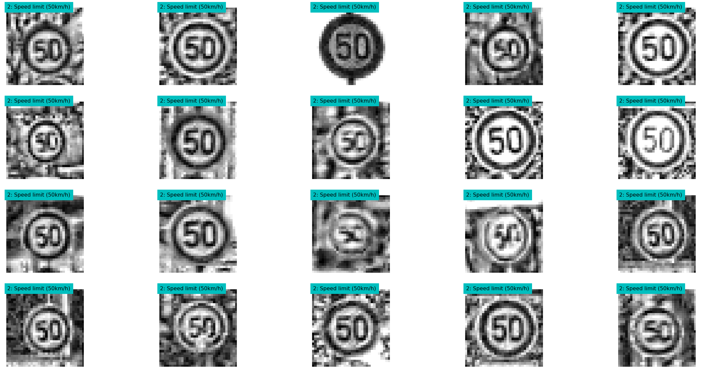
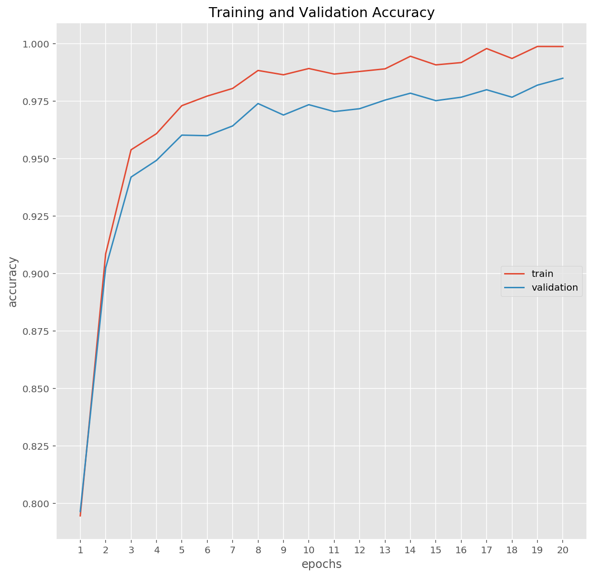
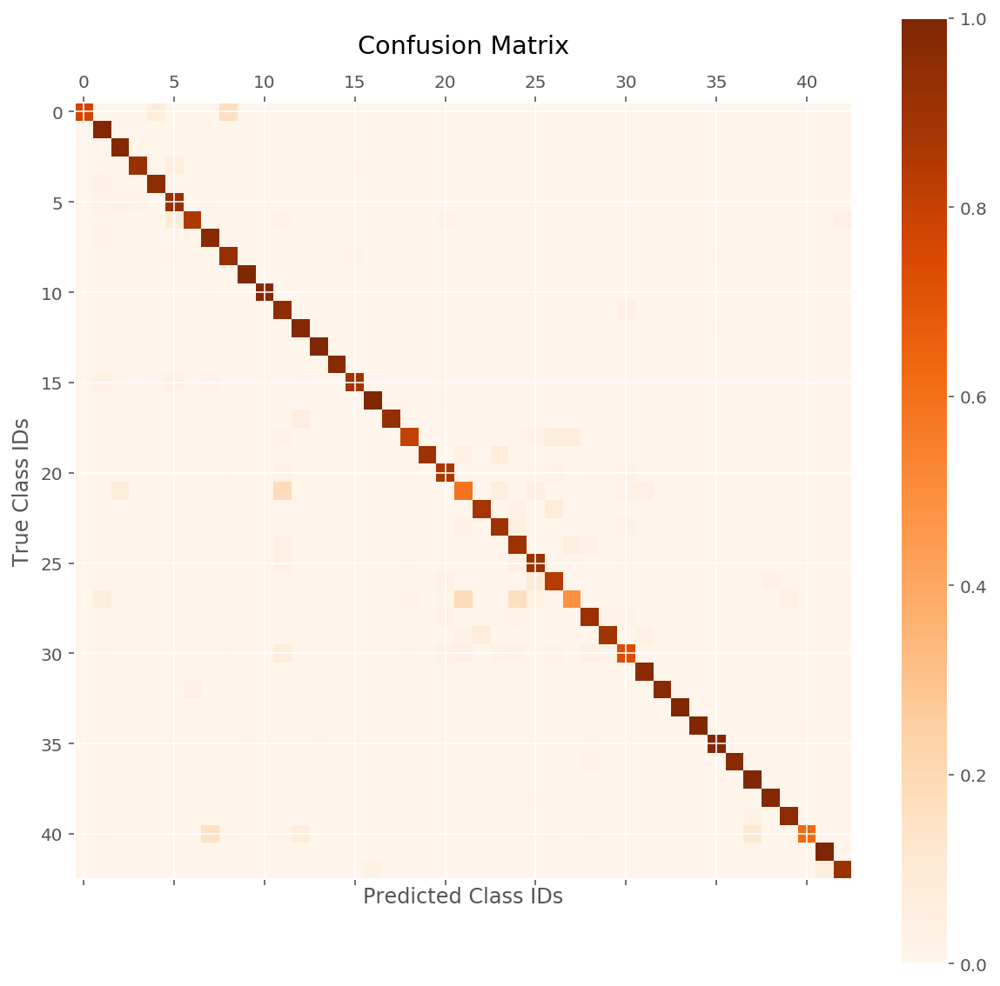
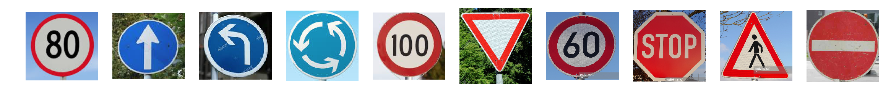
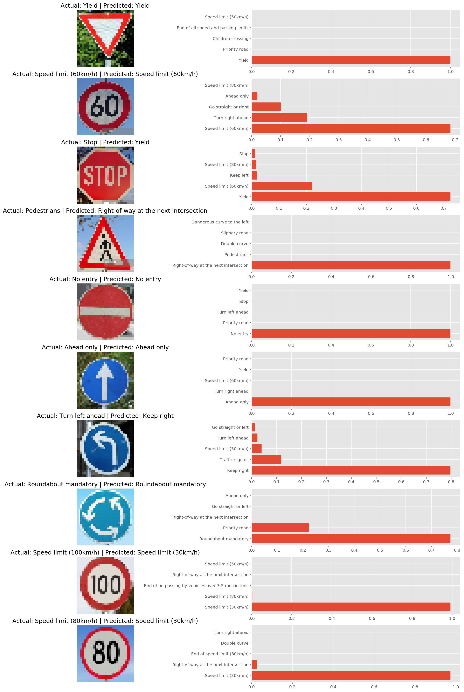

# Traffic Sign Classification

In this project, I've built and trained a deep neural network to classify German traffic signs using Tensorflow and Scikit-Learn's Pipeline framework.


# Getting Started

You can set up the required python library as follows:

```
conda env create -f environments-gpu.yml  # with GPU
```

If you have no CUDA-enabled GPU, you can use the following:

```
conda env create -f environments.yml  # with CPU
```

You can start the notebook as follows:

```
jupyter notebook German_Traffic_Sign_Classifier.ipynb
```

# Train and Test Data

> I have used [German Traffic Sign Dataset](http://benchmark.ini.rub.de/?section=gtsrb&subsection=dataset) where the bounding box locations and labels for  traffic signs are provided. Here is a random sample of images: 



> [Download the dataset](https://d17h27t6h515a5.cloudfront.net/topher/2016/November/581faac4_traffic-signs-data/traffic-signs-data.zip). This is a pickled dataset in which we've already resized the images to 32x32.

  * It contains three pickle (.p) files: 

    - train.p: The training set.
    - test.p: The testing set.
    - valid.p: The validation set.

We will use Python pickle to load the data.

## Data Set Summary & Exploration

I used the pandas library to calculate summary statistics of the traffic
signs data set:

* The size of training set is 35209
* The size of the validation set is 4000
* The size of test set is 12630
* The shape of a traffic sign image is (32, 32, 3)
* The number of unique classes/labels in the data set is 43

Here is an exploratory visualization of the data set. It is a bar chart showing how the data is 
ditributed across the different labels.



# Data Preprocessing

In this step, we will apply several preprocessing steps to the input images to achieve the best possible results.

We will use the following preprocessing techniques:

1. **Shuffling**: In general, we shuffle the training data to increase randomness and variety in training dataset, in order for the model to be more stable. We will use `sklearn` to shuffle our data.

2. **Grayscaling**: In their paper ["Traffic Sign Recognition with Multi-Scale Convolutional Networks"](http://yann.lecun.com/exdb/publis/pdf/sermanet-ijcnn-11.pdf) published in 2011, P. Sermanet and Y. LeCun stated that using grayscale images instead of color improves the ConvNet's accuracy. We will use `OpenCV` to convert the training images into grey scale.

3. **Normalization**: Normalization is a process that changes the range of pixel intensity values. Usually the image data should be normalized so that the data has mean zero and equal variance.

4. **Local Histogram Equalization**: This technique simply spreads out the most frequent intensity values in an image, resulting in enhancing images with low contrast. Applying this technique will be very helpfull in our case since the dataset in hand has real world images, and many of them has low contrast. We will use `skimage` to apply local histogram equalization to the training images.
 
## Original Images


## Preprocessed/Transformed Images


# Model Architecture and Results

## LeNet

The model is based on [LeNet](http://yann.lecun.com/exdb/lenet/) by Yann LeCun.  It is a convolutional neural network designed to recognize visual patterns directly from pixel images with minimal preprocessing.  It can handle hand-written characters very well. 


Source: http://yann.lecun.com/exdb/publis/pdf/lecun-98.pdf

Our model is adapted from the LeNet as follows.  

- The inputs are 32x32 (RGB - 3 channels) images
- The activation function is ReLU except for the output layer which uses Softmax
- The output has 43 classes

|Layer                       | Shape    |
|----------------------------|:--------:|
|Input                       | 32x32x3  |
|Convolution (valid, 5x5x6)  | 28x28x6  |
|Max Pooling (valid, 2x2)    | 14x14x6  |
|Activation  (ReLU)          | 14x14x6  |
|Convolution (valid, 5x5x16) | 10x10x16 |
|Max Pooling (valid, 2x2)    | 5x5x16   |
|Activation  (ReLU)          | 5x5x16   |
|Flatten                     | 400      |
|Dense                       | 120      |
|Activation  (ReLU)          | 120      |
|Dense                       | 84      |
|Activation  (ReLU)          | 84      |
|Dense                       | 43       |
|Activation  (Softmax)       | 43       |

## Results

### Learning curve



### Confusion Matrix




# Test a Model on New Images

Here are ten German traffic signs that I found on the web:



Since these images are not in the right shape accepted by the classifier they were downsampled and smoothed before applying the `preprocess_dataset` function.

Below I visualize the softmax probablities for each test image : 



